<style type="text/css">

slides > slide:not(.nobackground):after {
  content: '';
}

slides > slide {
    -webkit-transition:none !important;transition:none !important;
}

.build > * {
  -webkit-transition: opacity 0.1s ease-in-out;
  -webkit-transition-delay: 0.1s;
  -moz-transition: opacity 0.1s ease-in-out 0.1s;
  -o-transition: opacity 0.1s ease-in-out 0.1s;
  transition: opacity 0.1s ease-in-out 0.1s;
}

</style>

<!--
Export to pdf:
webshot function from webshot package.
Might have to change stuff in the style sheet to make it working.
library(webshot)
install_phantomjs()
fn <- paste0("file://", normalizePath("metabolomics.html"))
rmdshot("metabolomics.Rmd", "metabolomics.pdf")
-->

```{r echo = FALSE, message = FALSE, warning = FALSE}
library(xcms)
```

## LC-MS data analysis with `xcms` {.build}

<div>
- `xcms`: toolbox for LC-MS data analysis.
</div>

<div>
<div style="position:absolute; top:35%; width:60%;">
- Chromatographic peak detection: `findChromPeaks`.
</div>
<div style="position:absolute; top:20%; left:62%;">

</div>
</div>

<div>
<div style="position:absolute; top:50%; width:60%;">
- Alignment: `adjustRtime`.
</div>
<div style="position:absolute; top:39%; left:47%;">

</div>
</div>

<div>
<div style="position:absolute; top:65%; width:60%;">
- Correspondence: `groupChromPreaks`.
</div>
<div style="position:absolute; top:55%; left:62%;">

</div>
</div>

<div style="position:absolute; top:80%; width:90%;">
- **don't use defaults!** See [Metabolomics data pre-processing using
xcms](https://github.com/jorainer/metabolomics2018) workshop.
</div>

## {.build}

<div>- Result: `matrix` with feature abundances in samples.</div>
<div>- Annotation of features from LC-MS experiments challenging.</div>
<div>- LC-MS/MS data: MS2 spectra assist in annotation.</div>
<div>- Different technologies available...</div>
<div>- Added support for LC-MS/MS data analysis in `xcms`.</div>

## Analyzing DDA data with `xcms` {.build}

<div>
```{r out.width = "300px", echo = FALSE}

```
</div>

```{r message = FALSE, warning = FALSE}
dda_file <- system.file("TripleTOF-SWATH/PestMix1_DDA.mzML",
                        package = "msdata")
dda_data <- readMSData(dda_file, mode = "onDisk")
table(msLevel(dda_data))
```

## Analyzing DDA data with `xcms` {.build}

- MS1 chromatographic peak detection:
```{r warning = FALSE, message = FALSE}
cwp <- CentWaveParam(snthresh = 5, noise = 100, ppm = 10,
                     peakwidth = c(3, 30))
dda_data <- findChromPeaks(dda_data, param = cwp)
```

```{r warning = FALSE, message = FALSE}
dda_spectra <- chromPeakSpectra(dda_data)
dda_spectra
```

## Analyzing DDA data with `xcms` {.build}

- Example: annotate chrom peak with an m/z of 304.1131.
```{r message = FALSE, warning = FALSE}
chromPeaks(dda_data, mz = 304.1131, ppm = 20)
```

- Get MS2 spectra associated with that peak
```{r message = FALSE, warning = FALSE}
ex_spectra <- dda_spectra[mcols(dda_spectra)$peak_id == "CP53"]
```

## Analyzing DDA data with `xcms` {.build .smaller}

```{r message = FALSE, warning = FALSE, echo = FALSE}
ex_spectra
```

- Build *consensus* spectrum.
```{r message = FALSE, warning = FALSE}
ex_spectrum <- combineSpectra(ex_spectra, method = consensusSpectrum,
                              ppm = 10, minProp = 0.8)
ex_spectrum
```

## Analyzing DDA data with `xcms` {.build .smaller}

- Compare the consensus spectrum against 2 candidates with same m/z.

```{r echo = FALSE}
flumanezil <- spectra(readMgfData(
    system.file("mgf/metlin-2724.mgf", package = "xcms")))
fenamiphos <- spectra(readMgfData(
    system.file("mgf/metlin-72445.mgf", package = "xcms")))
ex_spectrum <- ex_spectrum[[1]]
flumanezil <- flumanezil[[3]]
fenamiphos <- fenamiphos[[2]]
```

```{r fig.width = 8, fig.height = 4}
par(mfrow = c(1, 2))
plot(ex_spectrum, flumanezil, main = "Flumanezil", tolerance = 40e-6)
plot(ex_spectrum, fenamiphos, main = "Fenamiphos", tolerance = 40e-6)
```

<!-- 100 of pages with SWATH data -->
## SWATH data

<div style="position:absolute; left:10%; top:25%">
```{r out.width = "800px", echo = FALSE}
knitr::include_graphics("images/SWATH-01.png")
```
</div>
## SWATH data

<div style="position:absolute; left:10%; top:25%">
```{r out.width = "800px", echo = FALSE}
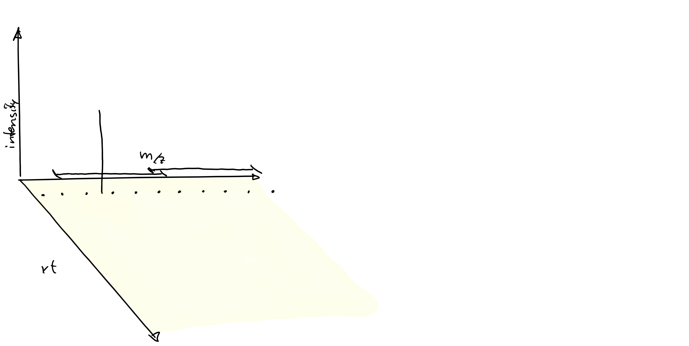
```
</div>
## SWATH data

<div style="position:absolute; left:10%; top:25%">
```{r out.width = "800px", echo = FALSE}
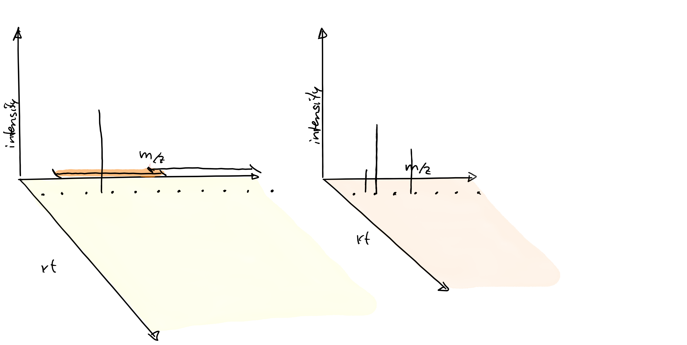
```
</div>
## SWATH data

<div style="position:absolute; left:10%; top:25%">
```{r out.width = "800px", echo = FALSE}
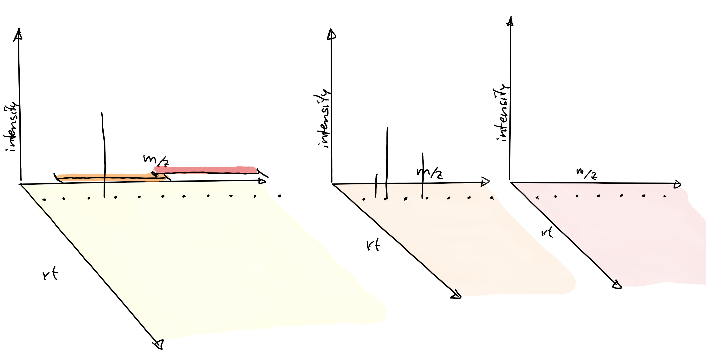
```
</div>
## SWATH data

<div style="position:absolute; left:10%; top:25%">
```{r out.width = "800px", echo = FALSE}

```
</div>
## SWATH data

<div style="position:absolute; left:10%; top:25%">
```{r out.width = "800px", echo = FALSE}
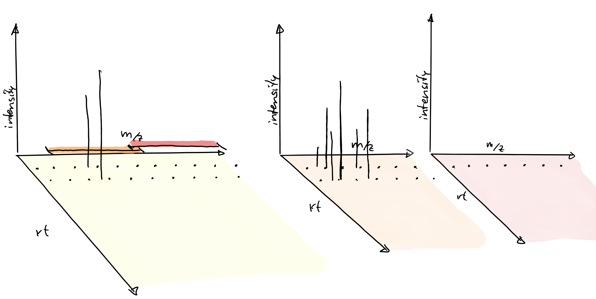
```
</div>
## SWATH data

<div style="position:absolute; left:10%; top:25%">
```{r out.width = "800px", echo = FALSE}

```
</div>
## SWATH data

<div style="position:absolute; left:10%; top:25%">
```{r out.width = "800px", echo = FALSE}

```
</div>
## SWATH data

<div style="position:absolute; left:10%; top:25%">
```{r out.width = "800px", echo = FALSE}

```
</div>
## SWATH data

<div style="position:absolute; left:10%; top:25%">
```{r out.width = "800px", echo = FALSE}

```
</div>
## SWATH data

<div style="position:absolute; left:10%; top:25%">
```{r out.width = "800px", echo = FALSE}
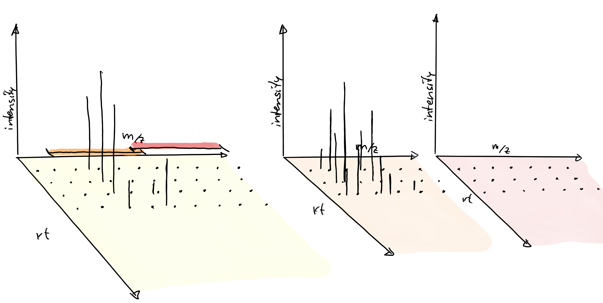
```
</div>
## SWATH data

<div style="position:absolute; left:10%; top:25%">
```{r out.width = "800px", echo = FALSE}

```
</div>
## SWATH data

<div style="position:absolute; left:10%; top:25%">
```{r out.width = "800px", echo = FALSE}

```
</div>
## SWATH data

<div style="position:absolute; left:10%; top:25%">
```{r out.width = "800px", echo = FALSE}

```
</div>
## SWATH data

<div style="position:absolute; left:10%; top:25%">
```{r out.width = "800px", echo = FALSE}

```
</div>
## SWATH data

<div style="position:absolute; left:10%; top:25%">
```{r out.width = "800px", echo = FALSE}

```
</div>
## SWATH data

<div style="position:absolute; left:10%; top:25%">
```{r out.width = "800px", echo = FALSE}
knitr::include_graphics("images/SWATH-17.png")
```
</div>
## SWATH data

<div style="position:absolute; left:10%; top:25%">
```{r out.width = "800px", echo = FALSE}

```
</div>
## SWATH data

<div style="position:absolute; left:10%; top:25%">
```{r out.width = "800px", echo = FALSE}
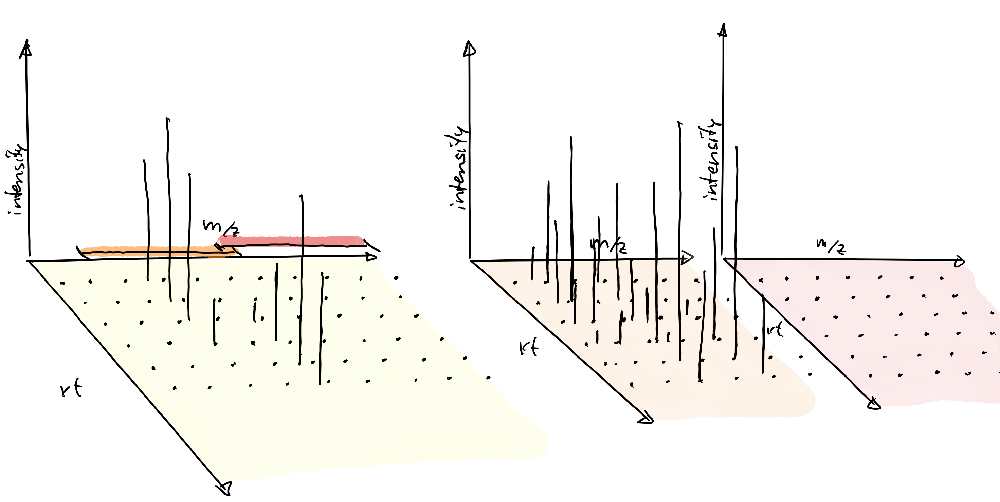
```
</div>
## SWATH data

<div style="position:absolute; left:10%; top:25%">
```{r out.width = "800px", echo = FALSE}
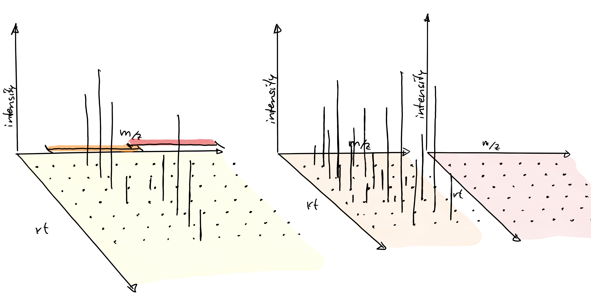
```
</div>
## SWATH data

<div style="position:absolute; left:10%; top:25%">
```{r out.width = "800px", echo = FALSE}

```
</div>
<!-- SWATH intro done -->


## Analyzing SWATH data with `xcms` {.build .smaller}

```{r echo = FALSE, message = FALSE, warning = FALSE}
swath_file <- system.file("TripleTOF-SWATH",
                          "PestMix1_SWATH.mzML",
                          package = "msdata")

swath_data <- readMSData(swath_file, mode = "onDisk")
```

<div>
- Chromatographic peak detection in MS1.
```{r message = FALSE, warning = FALSE}
cwp <- CentWaveParam(snthresh = 5, noise = 100, ppm = 10,
                     peakwidth = c(3, 30))
swath_data <- findChromPeaks(swath_data, param = cwp)
```
</div>
<div style="position:absolute; left:15%; top:55%">
```{r out.width = "600px", echo = FALSE}
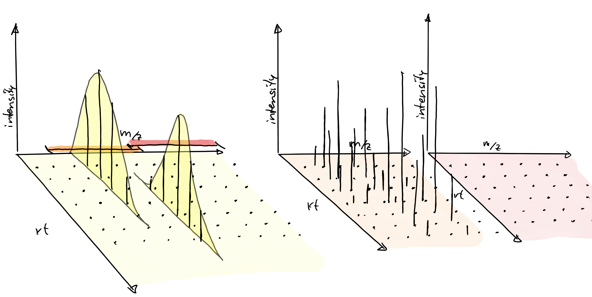
```
</div>


## Analyzing SWATH data with `xcms` {.smaller}

```{r echo = FALSE, message = FALSE, warning = FALSE}
swath_file <- system.file("TripleTOF-SWATH",
                          "PestMix1_SWATH.mzML",
                          package = "msdata")

swath_data <- readMSData(swath_file, mode = "onDisk")
```

- Chromatographic peak detection in MS1.
```{r message = FALSE, warning = FALSE}
cwp <- CentWaveParam(snthresh = 5, noise = 100, ppm = 10,
                     peakwidth = c(3, 30))
swath_data <- findChromPeaks(swath_data, param = cwp)
```

```{r echo = FALSE}
cwp <- CentWaveParam(snthresh = 3, noise = 10, ppm = 10,
                     peakwidth = c(3, 30))
```

- Chromatographic peak detection in MS2 (within each isolation window).
```{r message = FALSE, warning = FALSE}
swath_data <- findChromPeaksIsolationWindow(swath_data, param = cwp)
```

<div style="position:absolute; left:15%; top:55%">
```{r out.width = "600px", echo = FALSE}
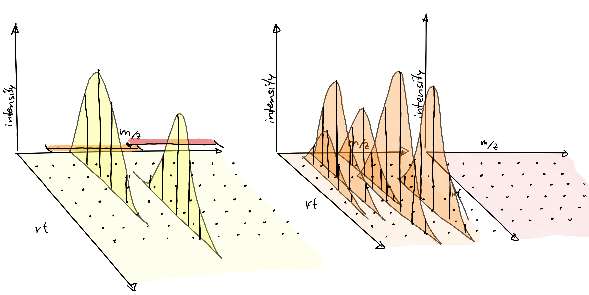
```
</div>


## Analyzing SWATH data with `xcms` {.smaller}

```{r echo = FALSE, message = FALSE, warning = FALSE}
swath_file <- system.file("TripleTOF-SWATH",
                          "PestMix1_SWATH.mzML",
                          package = "msdata")

swath_data <- readMSData(swath_file, mode = "onDisk")
```

- Chromatographic peak detection in MS1.
```{r message = FALSE, warning = FALSE}
cwp <- CentWaveParam(snthresh = 5, noise = 100, ppm = 10,
                     peakwidth = c(3, 30))
swath_data <- findChromPeaks(swath_data, param = cwp)
```

```{r echo = FALSE}
cwp <- CentWaveParam(snthresh = 3, noise = 10, ppm = 10,
                     peakwidth = c(3, 30))
```

- Chromatographic peak detection in MS2 (within each isolation window).
```{r message = FALSE, warning = FALSE}
swath_data <- findChromPeaksIsolationWindow(swath_data, param = cwp)
```

<div style="position:absolute; left:15%; top:55%">
```{r out.width = "600px", echo = FALSE}
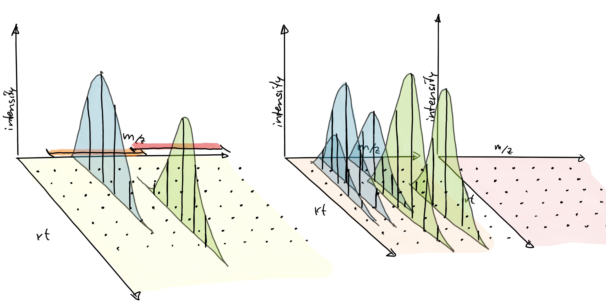
```
</div>


## Analyzing SWATH data with `xcms` {.build}

- Reconstructing MS2 spectrum from SWATH data:

```{r message = FALSE}
swath_spectra <- reconstructChromPeakSpectra(swath_data, minCor = 0.9)
```

- For each MS1 chromatographic peak:

  <div>- Find MS2 peaks (within the correct isolation window) with similar
      retention time.</div>
  <div>- Correlate peak shape of MS1 and candidate MS2 peaks.</div>
  <div>- Reconstruct the MS2 spectra based on matching MS2 peaks' m/z and
      intensity.</div>
	  

## Analyzing SWATH data with `xcms` {.build}

```{r}
swath_spectra
```

## Analyzing SWATH data with `xcms` {.build .smaller}

- Example: reconstructed MS2 spectrum for Fenamiphos.
```{r}
chromPeaks(swath_data, mz = 304.1131, ppm = 20, msLevel = 1L)
swath_sp <- swath_spectra[mcols(swath_spectra)$peak_id == "CP35"]
swath_sp
```

## Analyzing SWATH data with `xcms` {.build .smaller}

```{r fig.width = 8, fig.height = 4}
par(mfrow = c(1, 2))
plot(swath_sp[[1]], ex_spectrum, main = "DDA", tolerance = 40e-6)
plot(swath_sp[[1]], fenamiphos, main = "Fenamiphos", tolerance = 40e-6)
```


## Annotating MS2 spectra {.build}

<div>
<div style="width: 75%;">
- Export spectra and peak/feature intensities for [Feature-Based Molecular
  Networking](https://ccms-ucsd.github.io/GNPSDocumentation/featurebasedmolecularnetworking-with-xcms3/)
</div>
<div style="position:absolute; left:73%; top:22%">
```{r out.width = "200px", echo = FALSE}

```
</div>
</div>

<div>
- Compare `Spectra` against reference `Spectra`:
  - import from mgf files.
  - extract from a
  [CompoundDb](https://github.com/EuracBiomedicalResearch/CompoundDb) (R package
  to create and use compound annotation databases).
  - ...
</div>


## Future developments {.build}

<div>
<div style="position:absolute; left:65%; top:20%">
```{r out.width = "200px", echo = FALSE}

```
</div>
- [https://RforMassSpectrometry.org](https://RforMassSpectrometry.org)
</div>

<div>
<div style="width: 65%;">
- Define an efficient, expandable, flexible and well documented infrastructure
  for Mass Spectrometry data in R.
</div>
<div>
```{r out.width = "400px", echo = FALSE}
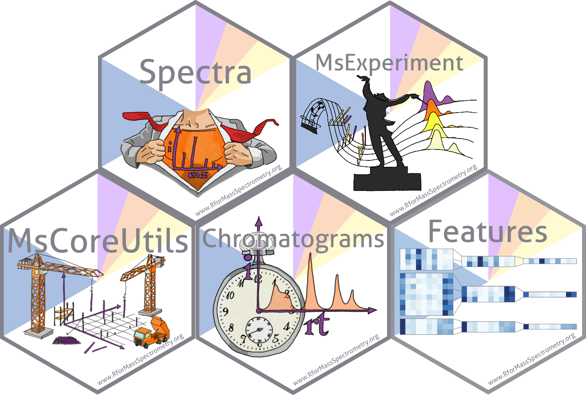
```
</div>
</div>

## 

- Introduction of *backends*: independence between functionality and data
  origin/storage.
  
```{r out.width = "500px", echo = FALSE}
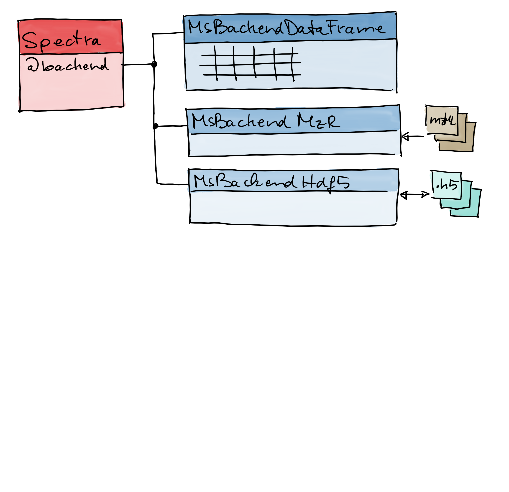
```

## 

- Introduction of *backends*: independence between functionality and data
  origin/storage.
  
```{r out.width = "500px", echo = FALSE}
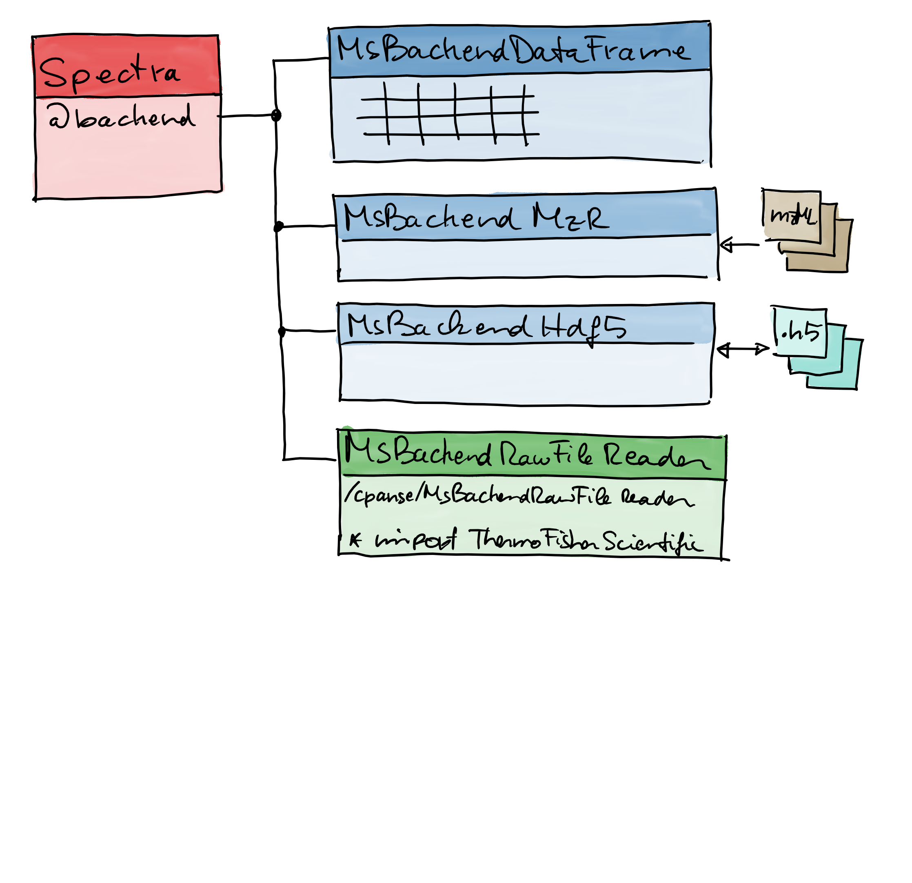
```

## 

- Introduction of *backends*: independence between functionality and data
  origin/storage.
  
```{r out.width = "500px", echo = FALSE}
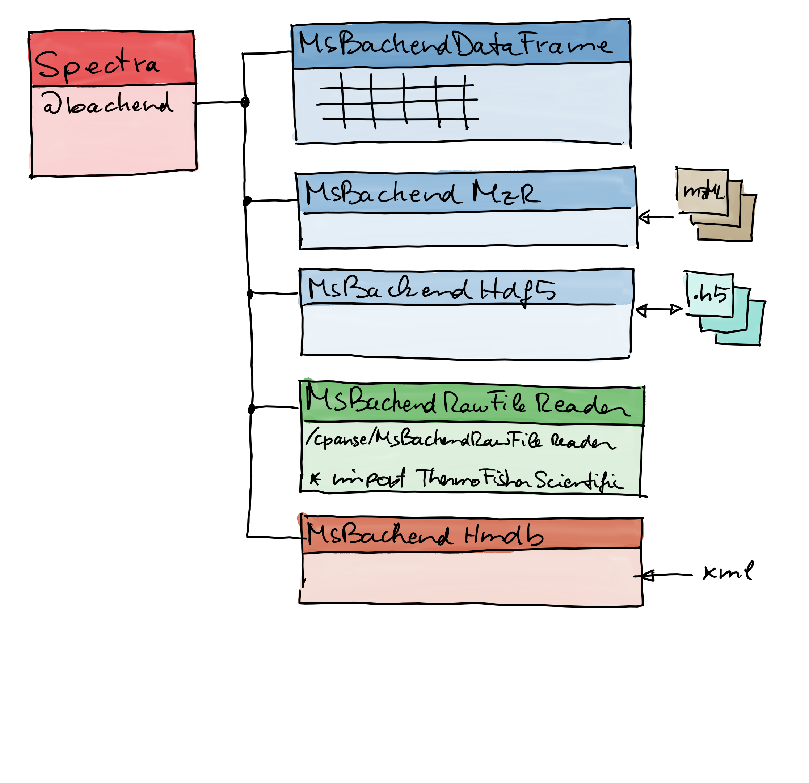
```

## 

- Introduction of *backends*: independence between functionality and data
  origin/storage.
  
```{r out.width = "500px", echo = FALSE}
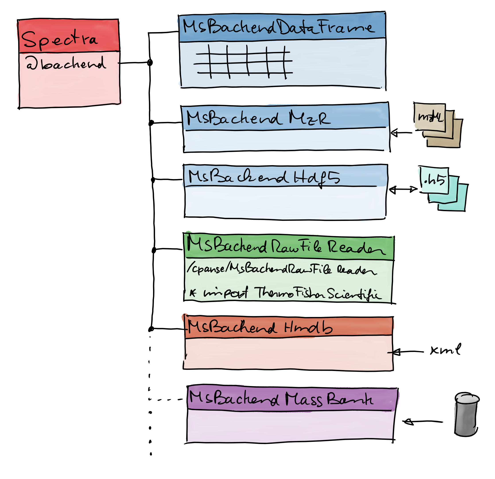
```

## 

- Introduction of *backends*: independence between functionality and data
  origin/storage.
  
```{r out.width = "500px", echo = FALSE}
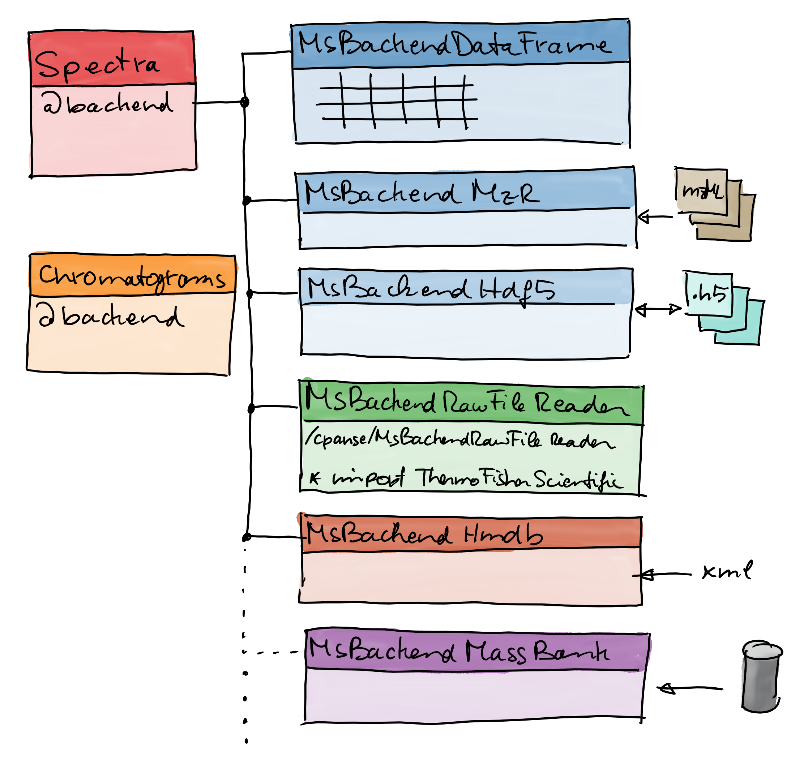
```

## 

<div style="position:absolute; left:15%; top:25%;font-size: 300%;">
**Thank you for your attention**
</div>

<div style="position:absolute; left:7%; top:60%;">
**Also thanks to**: Micheal Witting, Jan Stanstrup, Steffen Neumann, Sebastian Gibb, Laurent Gatto
</div>
