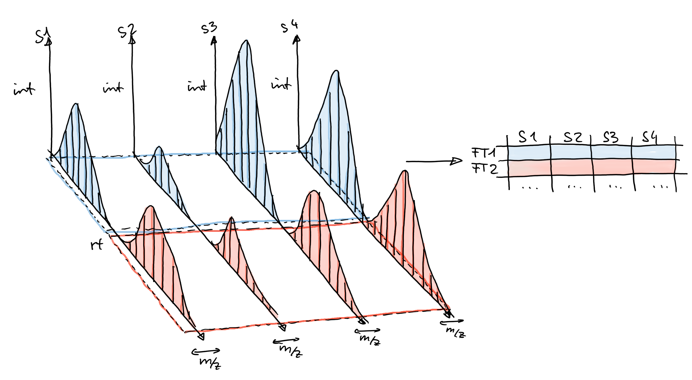

<style type="text/css">

slides > slide:not(.nobackground):after {
  content: '';
}

slides > slide {
    -webkit-transition:none !important;transition:none !important;
}

.build > * {
  -webkit-transition: opacity 0.1s ease-in-out;
  -webkit-transition-delay: 0.1s;
  -moz-transition: opacity 0.1s ease-in-out 0.1s;
  -o-transition: opacity 0.1s ease-in-out 0.1s;
  transition: opacity 0.1s ease-in-out 0.1s;
}

</style>

<!--
Export to pdf:
webshot function from webshot package.
Might have to change stuff in the style sheet to make it working.
library(webshot)
install_phantomjs()
fn <- paste0("file://", normalizePath("metabolomics.html"))
rmdshot("metabolomics.Rmd", "metabolomics.pdf")
-->

## Content

- Introduction.
- MS data handling, LC-MS data processing with `xcms`.
- LC-MS/MS data processing with `xcms`.

## |

```{r out.width = "600px", echo = FALSE}
knitr::include_graphics("images/Rlogo.png")
```


## R and Bioconductor {.build}

<div>- R: free software environment for statistical computing.</div>
<div>- Credo: **don't re-implement the wheel**.</div>
<div>- *Rmarkdown*: perfect tool to enable reproducible research.</div>
<div>- Bioconductor: R packages for biological data analysis.</div>
<div>- [Stanstrup et al. Metabolites 2019](https://doi.org/10.3390/metabo9100200).

```{r out.width = "480px", echo = FALSE}
knitr::include_graphics("images/metaRbolomics.png")
```
</div>

<div style="position:absolute; left:30%; top:40%;">
```{r out.width = "350px", echo = FALSE}
knitr::include_graphics("images/mass_spec_pkgs.png")
```
</div>

## MS data handling with `MSnbase` {.notransition}

<div style="position:absolute; left:30%; top:40%">
```{r out.width = "350px", echo = FALSE}
knitr::include_graphics("images/MSnExp-mzML.png")
```
</div>

## MS data handling with `MSnbase` {.notransition}

- `readMSData`: read MS data from raw files.

<div style="position:absolute; left:30%; top:40%">
```{r out.width = "350px", echo = FALSE}
knitr::include_graphics("images/MSnExp-readHeader.png")
```
</div>

## MS data handling with `MSnbase` {.notransition}

- `readMSData`: read MS data from raw files.

<div style="position:absolute; left:30%; top:40%">
```{r out.width = "350px", echo = FALSE}
knitr::include_graphics("images/MSnExp-readData.png")
```
</div>

## MS data handling with `MSnbase` {.notransition}

- `readMSData`: read MS data from raw files.

<div style="position:absolute; left:30%; top:40%">
```{r out.width = "350px", echo = FALSE}
knitr::include_graphics("images/MSnExp-user.png")
```
</div>

## MS data handling with `MSnbase` {.notransition}

- `readMSData`: read MS data from raw files.
- Alternative for *memory hungry* `MSnExp`: *on-disk* mode.

<div style="position:absolute; left:30%; top:40%">
```{r out.width = "350px", echo = FALSE}
knitr::include_graphics("images/OnDiskMSnExp-readHeader.png")
```
</div>

## MS data handling with `MSnbase` {.notransition}

- `readMSData`: read MS data from raw files.
- Alternative for *memory hungry* `MSnExp`: *on-disk* mode.
- Same user interface, but reads peak data on-demand.

<div style="position:absolute; left:30%; top:40%">
```{r out.width = "350px", echo = FALSE}
knitr::include_graphics("images/OnDiskMSnExp-readData.png")
```
</div>


## MS data handling with `MSnbase` {.build}

```{r hidden-centroiding, echo = FALSE, warning = FALSE, message = FALSE}
library(xcms)
library(magrittr)
register(SerialParam(), default = TRUE) 
fls <- dir(system.file("sciex", package = "msdata"), full.names = TRUE)

## Define a data.frame with additional information on the files.
pd <- data.frame(file = basename(fls), injection_idx = c(1, 19),
                 sample = c("POOL_1", "POOL_2"), group = "POOL")
## Read the data
data <- readMSData(fls, pdata = new("NAnnotatedDataFrame", pd), 
                   mode = "onDisk")
```

<div>- But what if we change the peak data?</div>
<div>- Example: smoothing and centroiding
```{r centroiding, warning = FALSE, message = FALSE}
data <- data %>%
    smooth(method = "SavitzkyGolay", halfWindowSize = 6) %>%
    pickPeaks()
```
</div>

<div>- How does that work?</div>
<div>- *Lazy evaluation queue*: data manipulations applied on-the-fly.</div>


## LC-MS data analysis with `xcms` {.build}

<div>
<div style="position:absolute; top:25%; width:60%;">
- Chromatographic peak detection: `findChromPeaks`.
</div>
<div style="position:absolute; top:7%; left:66%;">

</div>
</div>

<div>
<div style="position:absolute; top:45%; width:60%;">
- Alignment: `adjustRtime`.
</div>
<div style="position:absolute; top:30%; left:40%;">

</div>
</div>

<div>
<div style="position:absolute; top:65%; width:60%;">
- Correspondence: `groupChromPreaks`.
</div>
<div style="position:absolute; top:52%; left:62%;">

</div>
</div>

<div style="position:absolute; top:80%;">
- Result: `matrix` with feature abundances in samples.
</div>

## |

<div style="position:absolute; left:25%; top:33%;font-size: 400%;">
**Don't use defaults**
</div>

## Peak detection on EICs

## | **Evaluate correspondence analysis settings**

- use `plotChromPeakDensity`.

## |

<div style="position:absolute; left:17%; top:33%; font-size: 150%; width: 66%"> 
**Annotating chromatographic peaks and features remains a big challenge.**
</div>

## Analyzing LC-MS/MS data with `xcms` {.build}

- MS2 spectra can aid annotation.
- By extending `MSnbase`, `xcms` now supports also MSn data!
- Example workflows for DDA and SWATH data.

## Analyzing DDA data with `xcms` {.build}

<div>
```{r out.width = "300px", echo = FALSE}

```
</div>

```{r message = FALSE, warning = FALSE}
dda_file <- system.file("TripleTOF-SWATH/PestMix1_DDA.mzML",
                        package = "msdata")
dda_data <- readMSData(dda_file, mode = "onDisk")
table(msLevel(dda_data))
```

## Analyzing DDA data with `xcms` {.build}

- MS1 chromatographic peak detection:
```{r warning = FALSE, message = FALSE}
cwp <- CentWaveParam(snthresh = 5, noise = 100, ppm = 10,
                     peakwidth = c(3, 30))
dda_data <- findChromPeaks(dda_data, param = cwp)
```

```{r warning = FALSE, message = FALSE}
dda_spectra <- chromPeakSpectra(dda_data)
dda_spectra
```

## Analyzing DDA data with `xcms` {.build}

- Example: annotate chrom peak with an m/z of 304.1131.
```{r message = FALSE, warning = FALSE}
chromPeaks(dda_data, mz = 304.1131, ppm = 20)
```

- Get MS2 spectra associated with that peak
```{r message = FALSE, warning = FALSE}
ex_spectra <- dda_spectra[mcols(dda_spectra)$peak_id == "CP53"]
```

## Analyzing DDA data with `xcms` {.build .smaller}

```{r message = FALSE, warning = FALSE, echo = FALSE}
ex_spectra
```

- Build *consensus* spectrum.
```{r message = FALSE, warning = FALSE}
ex_spectrum <- combineSpectra(ex_spectra, method = consensusSpectrum,
                              ppm = 10, minProp = 0.8)
ex_spectrum
```

## Analyzing DDA data with `xcms` {.build .smaller}

- Compare the consensus spectrum against 2 candidates with same m/z.

```{r echo = FALSE}
flumanezil <- spectra(readMgfData(
    system.file("mgf/metlin-2724.mgf", package = "xcms")))
fenamiphos <- spectra(readMgfData(
    system.file("mgf/metlin-72445.mgf", package = "xcms")))
ex_spectrum <- ex_spectrum[[1]]
flumanezil <- flumanezil[[3]]
fenamiphos <- fenamiphos[[2]]
```

```{r fig.width = 8, fig.height = 4}
par(mfrow = c(1, 2))
plot(ex_spectrum, flumanezil, main = "Flumanezil", tolerance = 40e-6)
plot(ex_spectrum, fenamiphos, main = "Fenamiphos", tolerance = 40e-6)
```

<!-- 100 of pages with SWATH data -->
## SWATH data

<div style="position:absolute; left:10%; top:25%">
```{r out.width = "800px", echo = FALSE}
knitr::include_graphics("images/SWATH-01.png")
```
</div>
## SWATH data

<div style="position:absolute; left:10%; top:25%">
```{r out.width = "800px", echo = FALSE}

```
</div>
## SWATH data

<div style="position:absolute; left:10%; top:25%">
```{r out.width = "800px", echo = FALSE}

```
</div>
## SWATH data

<div style="position:absolute; left:10%; top:25%">
```{r out.width = "800px", echo = FALSE}

```
</div>
## SWATH data

<div style="position:absolute; left:10%; top:25%">
```{r out.width = "800px", echo = FALSE}

```
</div>
## SWATH data

<div style="position:absolute; left:10%; top:25%">
```{r out.width = "800px", echo = FALSE}

```
</div>
## SWATH data

<div style="position:absolute; left:10%; top:25%">
```{r out.width = "800px", echo = FALSE}

```
</div>
## SWATH data

<div style="position:absolute; left:10%; top:25%">
```{r out.width = "800px", echo = FALSE}

```
</div>
## SWATH data

<div style="position:absolute; left:10%; top:25%">
```{r out.width = "800px", echo = FALSE}
knitr::include_graphics("images/SWATH-09.png")
```
</div>
## SWATH data

<div style="position:absolute; left:10%; top:25%">
```{r out.width = "800px", echo = FALSE}

```
</div>
## SWATH data

<div style="position:absolute; left:10%; top:25%">
```{r out.width = "800px", echo = FALSE}

```
</div>
## SWATH data

<div style="position:absolute; left:10%; top:25%">
```{r out.width = "800px", echo = FALSE}
knitr::include_graphics("images/SWATH-12.png")
```
</div>
## SWATH data

<div style="position:absolute; left:10%; top:25%">
```{r out.width = "800px", echo = FALSE}
knitr::include_graphics("images/SWATH-13.png")
```
</div>
## SWATH data

<div style="position:absolute; left:10%; top:25%">
```{r out.width = "800px", echo = FALSE}
knitr::include_graphics("images/SWATH-14.png")
```
</div>
## SWATH data

<div style="position:absolute; left:10%; top:25%">
```{r out.width = "800px", echo = FALSE}
knitr::include_graphics("images/SWATH-15.png")
```
</div>
## SWATH data

<div style="position:absolute; left:10%; top:25%">
```{r out.width = "800px", echo = FALSE}
knitr::include_graphics("images/SWATH-16.png")
```
</div>
## SWATH data

<div style="position:absolute; left:10%; top:25%">
```{r out.width = "800px", echo = FALSE}
knitr::include_graphics("images/SWATH-17.png")
```
</div>
## SWATH data

<div style="position:absolute; left:10%; top:25%">
```{r out.width = "800px", echo = FALSE}
knitr::include_graphics("images/SWATH-18.png")
```
</div>
## SWATH data

<div style="position:absolute; left:10%; top:25%">
```{r out.width = "800px", echo = FALSE}

```
</div>
## SWATH data

<div style="position:absolute; left:10%; top:25%">
```{r out.width = "800px", echo = FALSE}
knitr::include_graphics("images/SWATH-20.png")
```
</div>
## SWATH data

<div style="position:absolute; left:10%; top:25%">
```{r out.width = "800px", echo = FALSE}
knitr::include_graphics("images/SWATH-21.png")
```
</div>
<!-- SWATH intro done -->


## Analyzing SWATH data with `xcms` {.build}

```{r echo = FALSE, message = FALSE, warning = FALSE}
swath_file <- system.file("TripleTOF-SWATH",
                          "PestMix1_SWATH.mzML",
                          package = "msdata")

swath_data <- readMSData(swath_file, mode = "onDisk")
```

- Chromatographic peak detection in MS1.
```{r message = FALSE, warning = FALSE}
cwp <- CentWaveParam(snthresh = 5, noise = 100, ppm = 10,
                     peakwidth = c(3, 30))
swath_data <- findChromPeaks(swath_data, param = cwp)
```

```{r echo = FALSE}
cwp <- CentWaveParam(snthresh = 3, noise = 10, ppm = 10,
                     peakwidth = c(3, 30))
```

- Chromatographic peak detection in MS2 (within each isolation window).
```{r message = FALSE, warning = FALSE}
swath_data <- findChromPeaksIsolationWindow(swath_data, param = cwp)
```

## Analyzing SWATH data with `xcms` {.build}

- Image of SWATH with identified peaks.
- Associate MS2 peaks with MS1 peak and reconstruct MS2 spectrum.

## Analyzing SWATH data with `xcms` {.build}

- Reconstructing MS2 spectrum from SWATH data:

```{r message = FALSE}
swath_spectra <- reconstructChromPeakSpectra(swath_data, minCor = 0.9)
```

> - For each MS1 chromatographic peak:
> - Find MS2 peaks (within the correct isolation window) with similar
  retention time.
> - Correlate peak shape of MS1 and candidate MS2 peaks.
> - Reconstruct the MS2 spectra based on matching MS2 peaks' m/z and intensity.

## Analyzing SWATH data with `xcms` {.build}

```{r}
swath_spectra
```

## Analyzing SWATH data with `xcms` {.build .smaller}

- Example: reconstructed MS2 spectrum for Fenamiphos.
```{r}
chromPeaks(swath_data, mz = 304.1131, ppm = 20, msLevel = 1L)
swath_sp <- swath_spectra[mcols(swath_spectra)$peak_id == "CP35"]
swath_sp
```

## Analyzing SWATH data with `xcms` {.build .smaller}

```{r fig.width = 8, fig.height = 4}
par(mfrow = c(1, 2))
plot(swath_sp[[1]], ex_spectrum, main = "DDA", tolerance = 40e-6)
plot(swath_sp[[1]], fenamiphos, main = "Fenamiphos", tolerance = 40e-6)
```


## Annotating MS2 spectra {.build}

- Export spectra and peak/feature intensities for *Feature-based molecular
  networking* with GNPS (image from GNPS).

- Compare `Spectra` against reference `Spectra`.

- [CompoundDb](https://github.com/EuracBiomedicalResearch/CompoundDb): create
  and use compound annotation databases:
  - Simple base object and database layout.
  - Other Objects extending the base object providing additional annotations.

## Future developments {.build}

- [RforMassSpectrometry](https://RforMassSpectrometry.org):
- Define a common, flexible, expandable and well documented infrastructure for
  Mass Spectrometry data in R.
- Introduction of *backends*: independence between functionality and data
  source.
- Backend could be a database providing reference MS2 spectra.
- Implementation of general spectrum functionality: comparison, joining, ...

- Put here an image of Backend thing.

## {.build}

<div style="position:absolute; left:15%; top:25%;font-size: 300%;">
**Thank you for your attention**
</div>

<div style="position:absolute; left:7%; top:60%;">
**Also thanks to**: Micheal Witting, Jan Stanstrup, Steffen Neumann, Sebastian Gibb, Laurent Gatto
</div>
